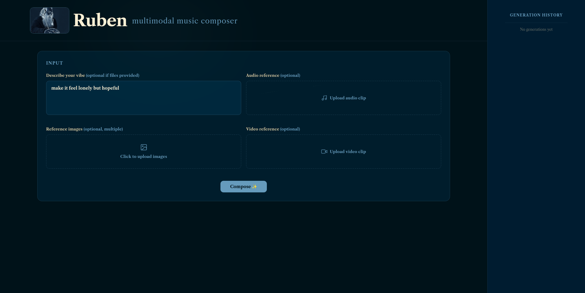
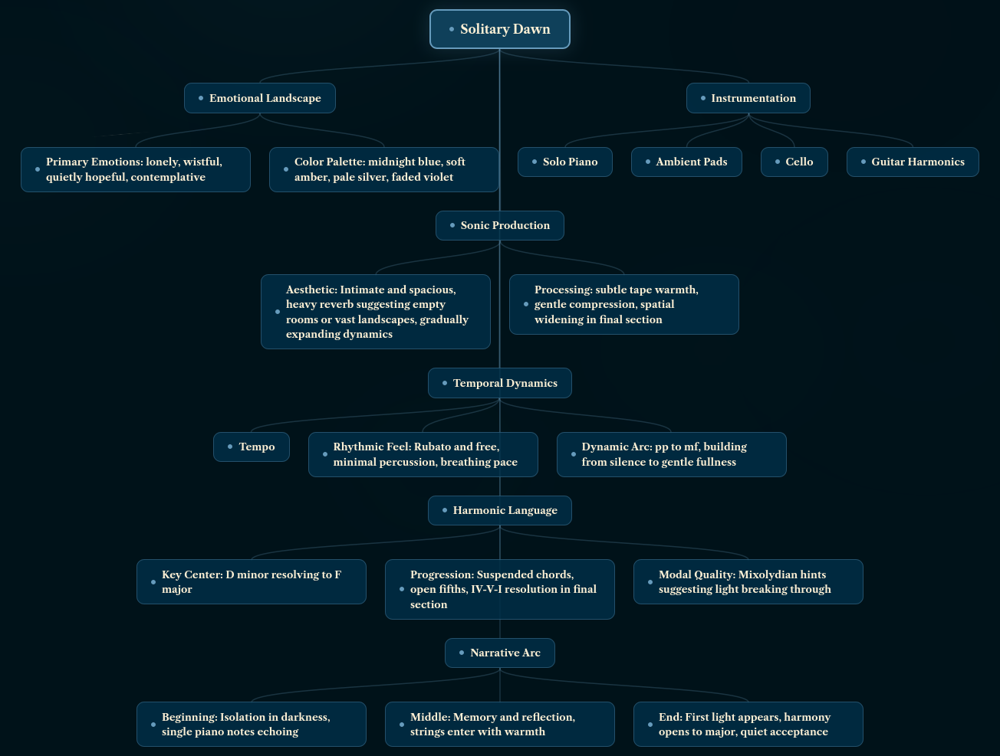
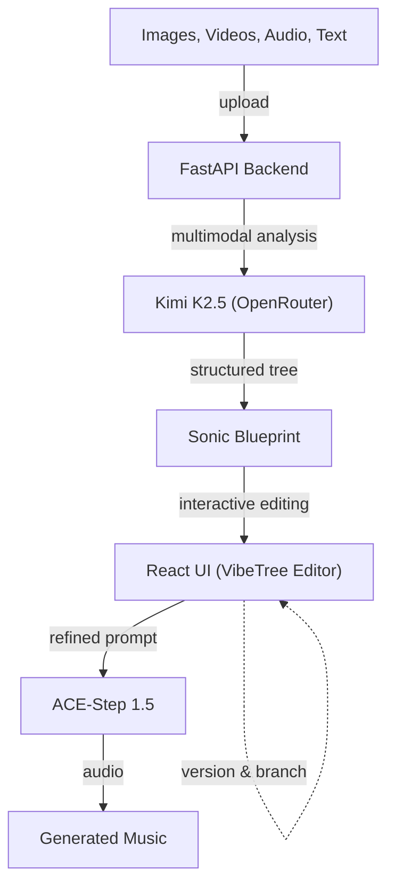

# Ruben

Ruben is an exploratory tool that lets people create music from images, videos, and text while gaining intuition for how AI models interpret multimodal inputs.

## Try It Out

A live demo is available at **http://157.230.208.203/**

## Screenshots

On startup, you will be greeted by this:



Running on a multimodal set of inputs produces an intermediate representation:



## How It Works

1. **Upload** source material — photos, videos, audio, or text descriptions
2. **Explore** the Sonic Blueprint — a hierarchical tree showing how the AI "reads" your inputs (mood, genre, instruments, texture)
3. **Edit** the blueprint interactively — tweak nodes, reshape sections, refine the representation
4. **Generate** music from the blueprint using ACE-Step 1.5, optionally with reference audio
5. **Version** your work — each run creates a checkpoint you can branch from or return to



## Tech Stack

- **Backend:** Python 3.12, FastAPI, Pydantic-AI
- **Frontend:** React 19, TypeScript, Vite
- **LLM:** Kimi K2.5 via OpenRouter (multimodal understanding)
- **Music Generation:** ACE-Step 1.5 (remote GPU via ngrok)
- **Deployment:** Docker Compose, Nginx

## Prerequisites

- [uv](https://docs.astral.sh/uv/) (Python package manager)
- Node.js and npm

## Quick Start

```bash
# 1. Configure environment
cp python-backend/.env.example python-backend/.env
# Edit .env with your API keys

# 2. Start both backend and frontend
./start_dev.sh
```

- API: http://127.0.0.1:8000 (docs at `/docs`)
- UI: http://localhost:5173

### Docker

```bash
docker-compose up --build
```

- API: port 8000
- UI: port 80

**Note:** Docker Compose starts only the backend API and the UI. The ACE-Step music generation server requires a CUDA GPU and must be set up separately on a GPU machine (see [ACE-Step Server Setup](#ace-step-server-setup)).

## Environment Variables

Create `python-backend/.env` from `.env.example`:

| Variable | Required | Description |
|----------|----------|-------------|
| `OPENROUTER_API_KEY` | Yes | OpenRouter API key for Kimi K2.5 |
| `ACESTEP_API_URL` | Yes | ACE-Step server URL (ngrok tunnel) |
| `ACESTEP_API_USER` | No | ACE-Step basic auth username |
| `ACESTEP_API_PASS` | No | ACE-Step basic auth password |
| `THINKING_BUDGET` | No | Kimi K2.5 thinking budget in tokens |
| `USE_MOCK` | No | Set `true` to skip API calls during development |

## ACE-Step Server Setup

The music generation backend runs ACE-Step 1.5 on a GPU machine and is exposed to the Ruben app via an ngrok tunnel.

### Requirements

- **Python 3.11**
- **CUDA GPU** with at least 4 GB VRAM (12 GB+ recommended for LLM features)
- **ngrok** account with an authtoken (and optionally a reserved domain)

### 1. Install dependencies

```bash
cd ace_step

# Option A: using uv (recommended)
uv sync

# Option B: using pip
python -m venv .venv && source .venv/bin/activate
pip install -r requirements.txt
pip install -e acestep/third_parts/nano-vllm   # optional, for faster LLM inference
```

### 2. Download models

Models are downloaded automatically on first run, or you can fetch them upfront:

```bash
uv run acestep-download          # downloads the default model set
# or
python -m acestep.model_downloader
```

### 3. Start the API server

```bash
uv run acestep-api               # listens on 0.0.0.0:8001
# or
python acestep/api_server.py
```

### 4. Expose via ngrok

Create a `.ngrok_env` file in the `ace_step/` directory:

```
NGROK_AUTHTOKEN=<your-ngrok-authtoken>
NGROK_DOMAIN=<your-reserved-domain>          # optional
AUTH_USERNAME=<basic-auth-user>               # optional
AUTH_PASSWORD=<basic-auth-pass>               # optional
```

Then run the tunnel (in a separate terminal):

```bash
python ace_endpoint.py
```

This prints the public URL (e.g. `https://your-domain.ngrok-free.dev`).

### 5. Point Ruben at the tunnel

In `python-backend/.env`, set:

```
ACESTEP_API_URL=https://your-domain.ngrok-free.dev
ACESTEP_API_USER=<basic-auth-user>            # if you set one above
ACESTEP_API_PASS=<basic-auth-pass>
```

## Project Structure

```
├── python-backend/    # FastAPI server, agentic LLM loop, ACE-Step client
├── ui/                # React + TypeScript frontend (VibeTree editor)
├── ace_step/          # ACE-Step 1.5 music generation model
├── docker-compose.yml
└── start_dev.sh       # One-command dev environment
```
