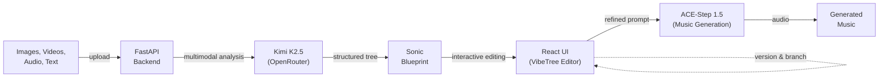

# Ruben

Ruben is an exploratory tool that lets people create music from images, videos, and text while gaining intuition for how AI models interpret multimodal inputs.

## Screenshots


## How It Works

1. **Upload** source material — photos, videos, audio, or text descriptions
2. **Explore** the Sonic Blueprint — a hierarchical tree showing how the AI "reads" your inputs (mood, genre, instruments, texture)
3. **Edit** the blueprint interactively — tweak nodes, reshape sections, refine the representation
4. **Generate** music from the blueprint using ACE-Step 1.5, optionally with reference audio
5. **Version** your work — each run creates a checkpoint you can branch from or return to



## Tech Stack

- **Backend:** Python 3.12, FastAPI, Pydantic-AI
- **Frontend:** React 19, TypeScript, Vite
- **LLM:** Kimi K2.5 via OpenRouter (multimodal understanding)
- **Music Generation:** ACE-Step 1.5 (remote GPU via ngrok)
- **Deployment:** Docker Compose, Nginx

## Quick Start

```bash
# 1. Configure environment
cp python-backend/.env.example python-backend/.env
# Edit .env with your API keys

# 2. Start both backend and frontend
./start_dev.sh
```

- API: http://127.0.0.1:8000 (docs at `/docs`)
- UI: http://localhost:5173

### Docker

```bash
docker-compose up --build
```

- API: port 8000
- UI: port 80

## Environment Variables

Create `python-backend/.env` from `.env.example`:

| Variable | Required | Description |
|----------|----------|-------------|
| `OPENROUTER_API_KEY` | Yes | OpenRouter API key for Kimi K2.5 |
| `ACESTEP_API_URL` | Yes | ACE-Step server URL (ngrok tunnel) |
| `ACESTEP_API_USER` | No | ACE-Step basic auth username |
| `ACESTEP_API_PASS` | No | ACE-Step basic auth password |
| `THINKING_BUDGET` | No | Kimi K2.5 thinking budget in tokens |
| `USE_MOCK` | No | Set `true` to skip API calls during development |

## Project Structure

```
├── python-backend/    # FastAPI server, agentic LLM loop, ACE-Step client
├── ui/                # React + TypeScript frontend (VibeTree editor)
├── ace_step/          # ACE-Step 1.5 music generation model
├── docker-compose.yml
└── start_dev.sh       # One-command dev environment
```
